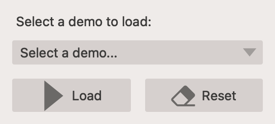

# CoreTool


## What is CoreTool?

CoreTool is a collection of small, well-documented napari plugins that provide an extensible interactive segmentation workflow for multidimensional images. The repository groups a set of core components and plugins so researchers and developers can prototype, extend, and evaluate promptable segmentation models (for example SAM-based models).

Main plugin(s) included in this repository:

- **napari-interactive** — the core plugin: an interactive segmentation widget that supports multi-object workflows and serves as the base class for model-specific plugins.
- **napari-interactive-2d-sam** — 2D plane segmentation using a SAM2-based model.
- **napari-interactive-2dt-sam** — 2D+t (or 3D) propagation: extends the 2D plugin with mask propagation between adjacent frames.
- **napari-interactive-3d-sam** — 3D segmentation using up to three orthogonal planes and a simple view-control UI.
- **napari-interactive-{2d,3d}-noregistration** — lightweight example plugins without ML models; useful for UI testing and as implementation templates.

Additional helper plugins:

- [**napari-edit-log**](./napari-edit-log/README.md) — logs user interactions to a file for replay and analysis.
- [**napari-shifted-labels**](./napari-shifted-labels/README.md)  — visualizes masks across frames to provide a more consistent segmentation experience.

The documentation for these plugins is available in their respective folders.

## Table of contents

- [Quick start](#quick-start)
- [Installation](#installation)
- [Usage overview](#usage-overview)
- [Reference](#reference)
  - [Importing/Opening images](#importingopening-images)
  - [Prediction behaviour](#prediction-behaviour)
  - [Exporting masks](#exporting-masks)
  - [Reset](#reset)
  - [Asthetics](#asthetics)
  - [Windowing / contrast](#windowing--contrast)
  - [Multi-object mode](#multi-object-mode)
  - [Propagation (2D+t / 3D / >2D)](#propagation-2dt--3d---2d)
  - [Keyboard control](#keyboard-control)
  - [DemoWidget](#demowidget)
- [Development & contributing](#development--contributing)
  - [Development setup](#development-setup)
  - [Adding support for new models](#adding-support-for-new-models)
  - [Using napari-interactive as a library](#using-napari-interactive-as-a-library)
- [Roadmap](#roadmap)
- [License](#license)
- [Acknowledgments](#acknowledgments)

## Installation

### Prerequisites

CoreTool requires a working napari installation. Some model-backed plugins (for example SAM2 variants) will require a CUDA-capable GPU and the matching PyTorch + CUDA runtime for best performance. The project is tested on macOS and Linux. Windows may work as well but may encounter platform-specific issues. Please report any problems.

### Local installation (developer / editable install)

For the local installation, clone the repository and install plugin packages in editable mode (`pip install -e` for all plugin folders). This enables fast iteration and hot-reloading during development.


```bash
# clone the repository
git clone <repo-url>
cd core_project

# install each plugin in editable mode (example pattern)
for plugin in ./napari-*; do
    if [ -d "$plugin" ]; then
        echo "Installing $plugin"
        pip install -e "$plugin"
    fi
done
```

After installation, start napari (`napari` or `python3 startup.py`) and open the plugin from the Plugins menu. Alternatively, use the `startup.py` script to launch napari with the demo plugin preloaded.


## Quick start

If you just want to try the demo widget and inspect the UI, run:

```bash
python3 startup.py
```

This opens napari with the demo plugin preloaded. We recommend opening the 2D SAM2 demo when following the usage guide below.

### Install selected plugins only (non-developer)

If you only need a single plugin and do not want an editable install, install the package directly from a git URL. Example:

```bash
# Example (replace with the real repo/subdirectory):
pip install git+https://git.repo/some_repo.git#egg=PACKAGE_NAME&subdirectory=SUBDIR
```

### Docker (optional)

We also provide Docker run scripts for GUI-enabled/testing environments (see `script.sh` / `script_web.sh`). The containers are large and meant for reproducible runs and CI, not lightweight local development. If you use Docker, make sure to mount any datasets and (when needed) model checkpoints.

## Usage overview

The plugins share a common interaction model:

1. [Open an image](https://napari.org/stable/tutorials/fundamentals/quick_start.html#open-an-image) (drag & drop or `File → Open`).


2. Choose a plugin from the Plugins menu. The control panel appears on the right.

3. Select the image layer to segment. Changing the image layer will reset plugin state.

4. Choose a prompt type (Points, Box, Mask, etc.).

> Tip: Based on the selected prompt type, different prompt layers will appear in the __layerlist__ (typically on the left). For example, if you select the `Points` prompt type, two new layers will be created, one for foreground points and one for background points. For the `Box` prompt type, only a single layer for the bounding box will be created. For the `Mask` prompt type, a single layer for the input mask will be created.

5. With such a `prompt layer` selected, use the respective napari tool to add prompts to the image. For this purpose, use the layer control panel (typically on the top left) to input the desired prompt.

6. Optionally adjust `hyperparameters` in the control panel.

7. Optionally use the `View Control` section of the control panel if the widget requires certain additional steps. For example the 3D segmentation widget requires you to select up to three orthogonal planes in the viewer.

8. Use `AutoRun` (default) for live updates, or click `Predict` to run on demand.

9. For multi-object workflows, use the Multi Object controls to switch and label different targets.
> Tip: You can change the color and opacity of each label using the [napari-labels](https://github.com/MIC-DKFZ/napari-labels) plugin.

> Tip: Currently only non-overlapping objects are supported.

10. Optionally use post-prediction features, such as `Propagation` of masks to adjacent frames (for 2D+t or 3D images). These features are controlled via additional control panels, typically located below the `Predict` button.

11. Export results using the Export options (see below) or reset the session with `Reset`.

Tip: You can customize label colors and opacity with the `napari-labels` plugin.

## Reference
The following section contains more detailed information on how to use the tool.

### Importing/Opening images

See the napari documentation on [how to open images](https://napari.org/stable/tutorials/fundamentals/quick_start.html#open-an-image) for more information.

> Tip: Napari can open most image formats, with plugins available for more exotic formats. This leads to you maybe beeing asked with a dialog to select a plugin for opening your image. In most cases the default option (napari builtins) should work fine.

### Prediction behaviour

The default behavior is to re-run predictions when prompts or hyperparameters change (AutoRun). If predictions are slow, disable AutoRun and use the `Predict` button when ready.


### Exporting masks

Masks can be exported in two ways:

- Export to layer: copies the current preview into a new labels layer in napari (useful for further editing/visualization).
- Export to file: saves the mask to disk at the chosen path. The exported array preserves shape and dimensionality and is saved as uint8 by default.


### Reset

The `Reset` button clears the preview and prompt layers and resets the underlying model state.


### Asthetics

> Tip: You can change the color and opacity of each label using the [napari-labels](https://github.com/MIC-DKFZ/napari-labels) plugin.

### Windowing / contrast

For windowing and contrast controls the `napari-brightness-contrast` plugin is recommended.


### Multi-object mode

Use the multi-object controls to create and switch between object IDs while segmenting. This is useful when annotating multiple distinct structures in a single volume.


> Tip: Currently only non-overlapping objects are supported.

### Propagation (2D+t / 3D / >2D)

The propagation panel lets you propagate masks along a chosen axis, from one frame to the next.

Typical controls:

- dimension selector (which axis to propagate along)
- direction (forward / reverse)
- overwrite existing (whether to replace masks in the destination frame)
- step (propagate one frame)
- run (continuous propagation)

Multiple objects (with the same label index) can be propagated in parallel.


> Tip: The run option typically uses a larger prompt memory bank (for SAM2) and can give more consistent results than repeatedly clicking Step.

### Keyboard control

Napari (and the plugins of the core-tool) support a variety of keyboard shortcuts for controlling the viewer. They are mostly also tied to UI elements and can be discoverd by hovering with the pointer over any given UI element.

The most useful viewer shortcuts (for the purpose of interactive segmentation) include:

- **Switching between the tools**: "Number keys" (1-9)
- **Moving between frames**: "Arrow keys" (left / right)
- ...

The most usefull shortcuts from the core project plugins include:

- **Add new label**: `N`
- ...

> Tip: You can also customize these shortcuts to your liking in the [napari preferences menu](https://napari.org/dev/guides/preferences.html#shortcuts-settings).

### DemoWidget

The Demo Widget was developed to enable an easy showcase the core tool. It loads example imaging data and a correspoding interactive segmentation plugin.



> Tip: Adding an new plugin/extended widget to the demo allows you to quickly reload the widget after changes to its code.

## Development & contributing

We welcome contributions that align with the goals of the project.

### Development setup

1. Follow the Local installation steps above.
2. Use the `development.ipynb` notebook for hot-reloading during UI development, or run `startup.py` if you prefer a non-hot-reload session.

3. Make any desired changes to the source code.

### Adding support for new models

1. Follow the local setup guide above.

2. Select what mode/dimensionality your model/plugin should support. The core tool currently supports segmentation in one 2D plane, propagation from one 2D plane to an adjacent one (for 3D or 2D+t segmenation), and segmentation in 3D based on up to three prompts in orthogonal planes. Other modes can be implemented by extending the __view_control__ section of the base widget, see the [3D segmentataion](napari-interactive/src/napari_interactive/_widget_3d_sam.py) widget as an example.

3. Select a comperable widget and clone the respective file in `napari-interactive/src/napari_interactive/`.

4. Rename the copied file, for example `_widget_<mode>_<model>.py`.

5. Rename the widget class in that file.

6. Add the newly created widget class to the `__init__.py` and `napari.yaml` files.

7. (optionally) Create a demo to quickly load your new plugin, by extending the `demo_widget.py` file.

8. (optionally) use the `development.ipynb` notebook to start napari and enable hot-reloading of your plugin.

9. Start developing.

10. For loading model checkpoints we recomment hosting them on huggingface and downloading them on-demand via `huggingface_hub`. Alternatively, you can store them somewhere local.


> Tips for model authors:

> - Pick a comparable widget and copy its structure.
> - Implement `load_model`, `predict`, and `reset_model` following the existing patterns.
> - Prefer on-demand model download via `huggingface_hub` for large checkpoints, or document where to place local checkpoints (for example `MedSAM2_latest.pt`).

### Using napari-interactive as a library

Alternatively, you can import the napari-interactive plugin class and create a new pip package for your model. See [here](https://napari.org/dev/plugins/building_a_plugin/first_plugin.html#your-first-plugin) on how to create a new napari-plugin.

1. Create a new plugin.

2. Add `napari-interactive` as a dependencie to your `requirements.txt`.

3. Import whatever widget class you want to use as parent and implement the plugin for your own model.

## Roadmap

Planned short- and mid-term improvements:

- Better developer documentation and examples.
- Automatic model loading from Hugging Face.
- Additional windowing and visualization plugins.
- Integration of more specialized segmentation models.
- Advanced label-management tools and edit-log replay/analysis.

## License

This repository is currently not licensed. It will be licensed under an open-source license in the near future upon release.

The `napari_toolkit` subfolder is a fork of [napari-toolkit](https://github.com/MIC-DKFZ/napari_toolkit). It is licensed under the terms of the [Apache Software License 2.0] license.

## Acknowledgments

This project is developed and maintained by the [LMU Adaptive Radiation Therapy Lab](https://lmu-art-lab.userweb.mwn.de/) (LMU ART Lab) at the  [Department of Radiation Oncology, LMU University Hospital](https://www.lmu-klinikum.de/strahlentherapie-und-radioonkologie/forschung/physikalische-forschung/5e34c41a1e300c37), Munich, Germany, in the context of the [BZKF Lighthouse on Local Therapies](https://bzkf.de/f/forschung/leuchttuerme/lokale-therapien/).


For more information about napari and related toolkits see:

[napari]: https://github.com/napari/napari
[napari_toolkit]: https://github.com/MIC-DKFZ/napari_toolkit